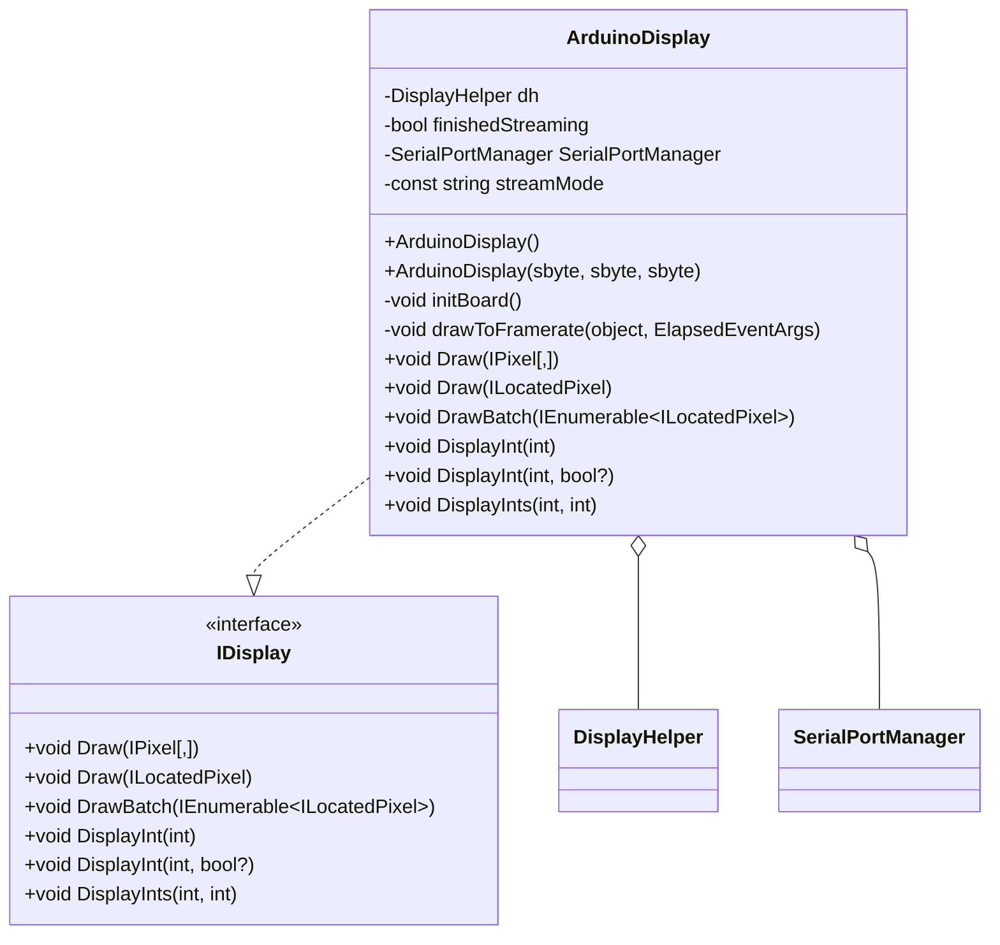

```mermaid
classDiagram
    class IDisplay {
        <<interface>>
        +void Draw(IPixel[,])
        +void Draw(ILocatedPixel)
        +void DrawBatch(IEnumerable~ILocatedPixel~)
        +void DisplayInt(int)
        +void DisplayInt(int, bool?)
        +void DisplayInts(int, int)
    }

    class ArduinoDisplay {
        -DisplayHelper dh
        -bool finishedStreaming
        -SerialPortManager SerialPortManager
        -const string streamMode
        +ArduinoDisplay()
        +ArduinoDisplay(sbyte, sbyte, sbyte)
        -void initBoard()
        -void drawToFramerate(object, ElapsedEventArgs)
        +void Draw(IPixel[,])
        +void Draw(ILocatedPixel)
        +void DrawBatch(IEnumerable~ILocatedPixel~)
        +void DisplayInt(int)
        +void DisplayInt(int, bool?)
        +void DisplayInts(int, int)
    }

    class DisplayHelper
    class SerialPortManager

    ArduinoDisplay ..|> IDisplay
    ArduinoDisplay o-- DisplayHelper
    ArduinoDisplay o-- SerialPortManager
```
