# PixelCatsFork

This project contains a set of classes and interfaces for managing and displaying a pixel board, including hardware and console display backends, pixel representations, and serial communication helpers.

Below are class diagrams (in Mermaid format) for all major classes and interfaces in the **PixelBoard** project.  
You can paste these into a Markdown viewer that supports Mermaid, or view directly on GitHub with a Mermaid extension.

---

### ArduinoDisplay

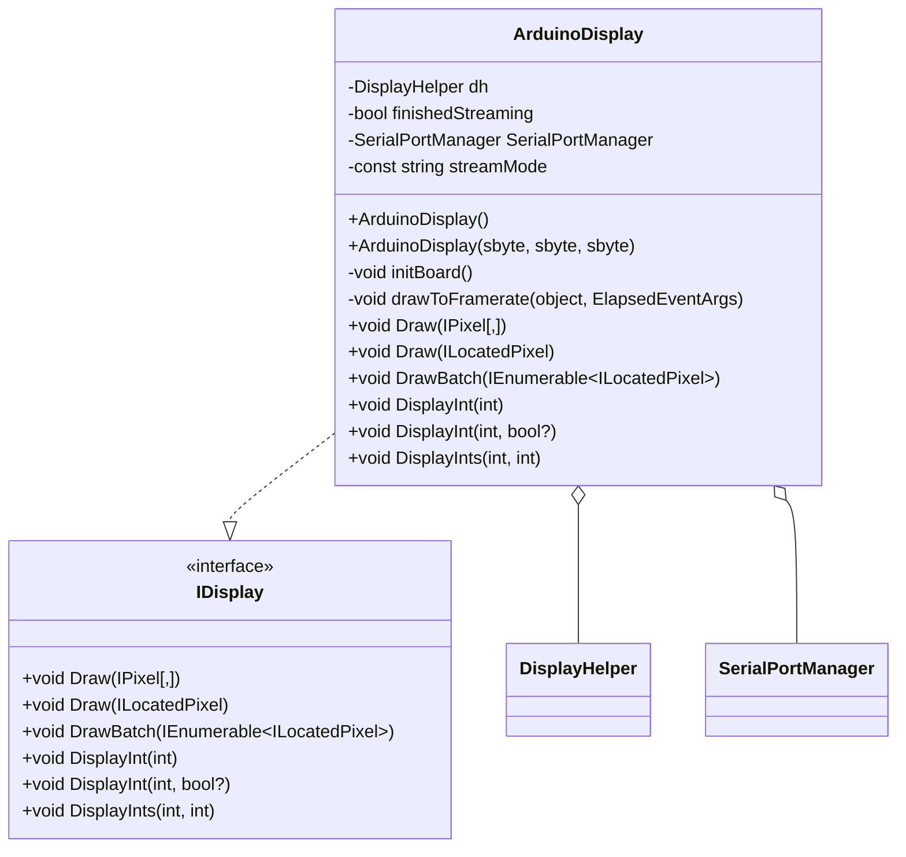

---

### ArduinoInput

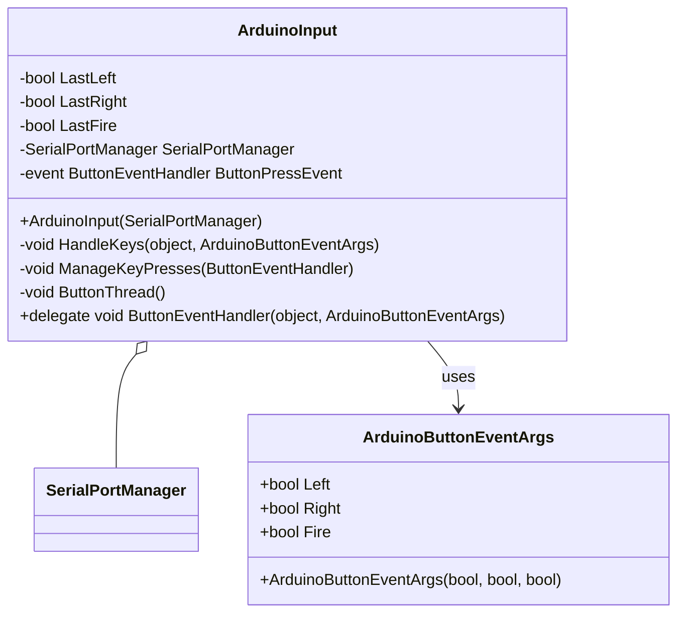

---

### ConsoleDisplay

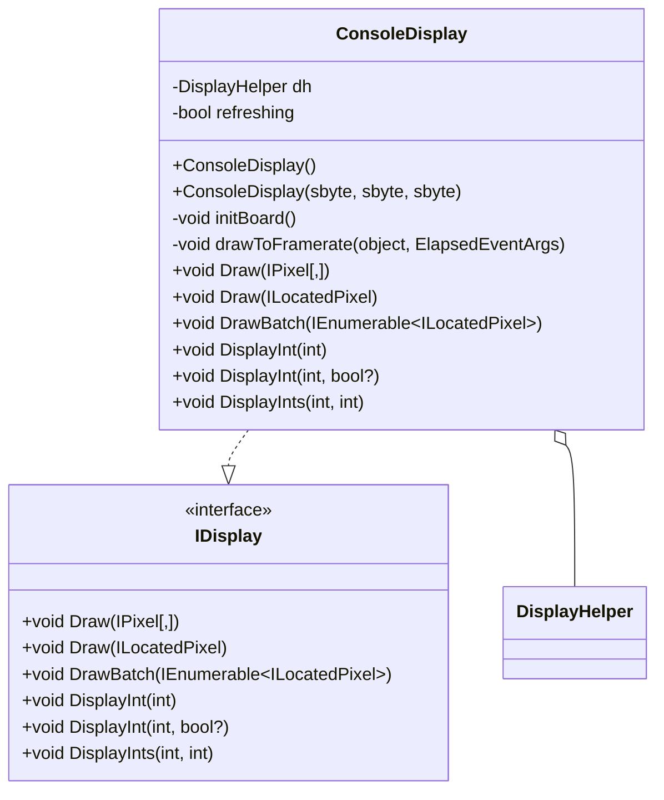

---

### DisplayHelper

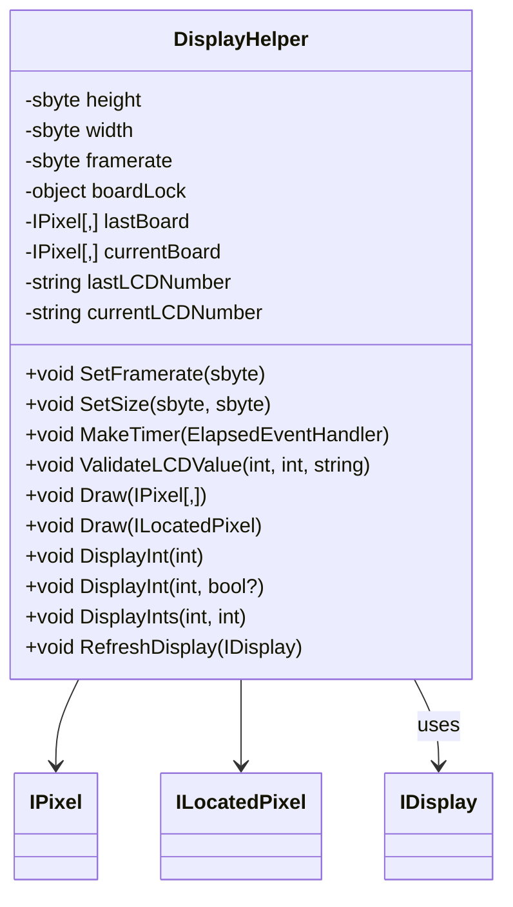

---

### IArduinoInput

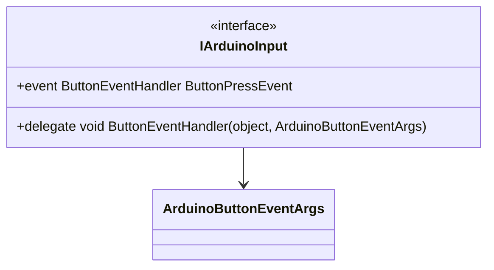

---

### IDisplay

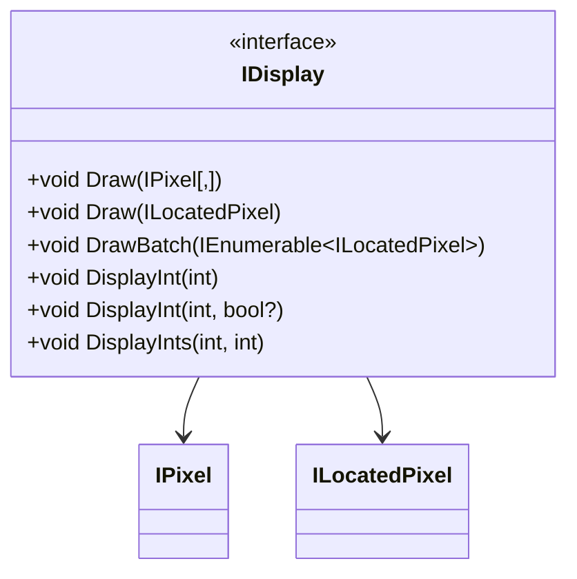

---

### ILocatedPixel

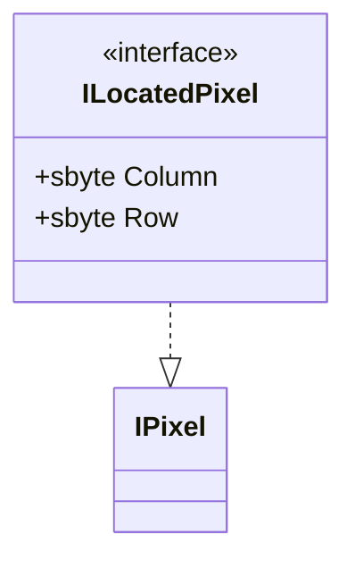

---

### IPixel

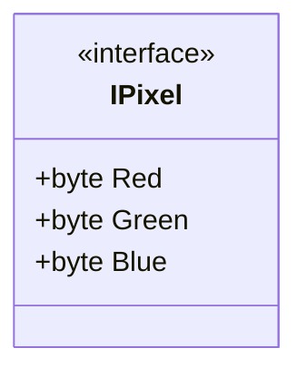

---

### LocatedPixel

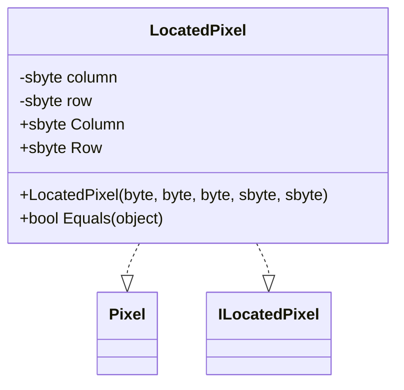

---

### Pixel

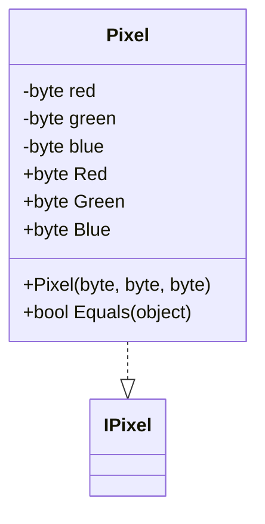

---

### SerialPortManager

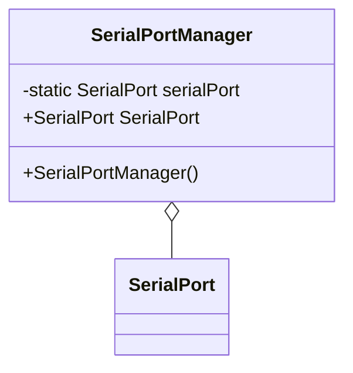
