# PixelCatsFork

## Project navigation

Use this quick map to find the main entry points in the repo:

- `PixelGame.sln` — open this solution to load all primary projects.
- `PixelBoardDisplay/` — shared display/input abstractions and board integration code.
- `ConsoleTest/` — console-hosted game runner and game implementations.
- `ConsoleTest.Tests/` — unit tests for console/game and API client behavior.
- `HerdingCats/` — standalone game project.
- `PixelCatsClient/` and `Client/` — client applications.
- `shared/latest_score.json` — shared score output consumed by parts of the solution.

### Quick start by goal

- **Run core console game loop**: start in `ConsoleTest/Program.cs`.
- **Work on board rendering or Arduino integration**: start in `PixelBoardDisplay/`.
- **Run or add tests**: start in `ConsoleTest.Tests/`.

---

## Prerequisites

- .NET SDK 9.x
- Visual Studio 2022 (optional)

## Build / run / test

From the repo root:

```sh
dotnet build PixelGame.sln
dotnet run --project ConsoleTest/ConsoleTest.csproj
dotnet test
```

## Configuration

`ConsoleTest` loads configuration from `appsettings.json` (optional) and environment variables.

- `UseEmulator` (bool) — defaults to `true`
- `Leaderboard:BaseUrl` (string) — defaults to `http://127.0.0.1:3000`
  - Environment variable form: `Leaderboard__BaseUrl`
- HMAC secrets:
  - `LEADERBOARD_HMAC_SNAKE`
  - `LEADERBOARD_HMAC_TETRIS`
  - `LEADERBOARD_HMAC_EDU`

## Score export

`ConsoleTest` writes to:

```text
shared/latest_score.json
```

This path is relative to the repository root when possible.

## Adding a new game

To add a new game in `ConsoleTest`:

1. Implement `ConsoleTest/Games/IGame.cs`.
2. Register the game in `ConsoleTest/Program.cs` inside the `games` dictionary.

---

## Class diagrams

Below are class diagrams, in Mermaid format, for the major classes and interfaces in the PixelBoard project.

---

### ArduinoDisplay

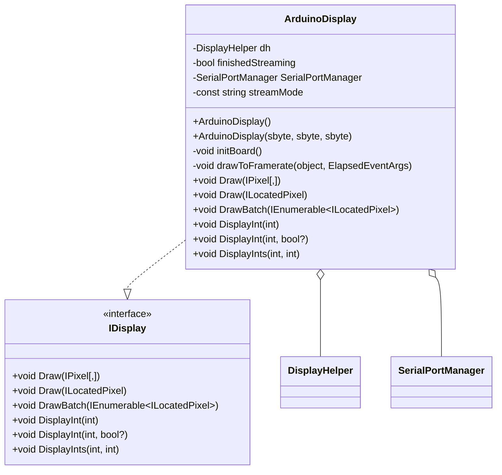
```mermaid
classDiagram
    class IDisplay {
        <<interface>>
        +void Draw(IPixel[,])
        +void Draw(ILocatedPixel)
        +void DrawBatch(IEnumerable~ILocatedPixel~)
        +void DisplayInt(int)
        +void DisplayInt(int, bool?)
        +void DisplayInts(int, int)
    }

    class ArduinoDisplay {
        -DisplayHelper dh
        -bool finishedStreaming
        -SerialPortManager SerialPortManager
        -const string streamMode
        +ArduinoDisplay()
        +ArduinoDisplay(sbyte, sbyte, sbyte)
        -void initBoard()
        -void drawToFramerate(object, ElapsedEventArgs)
        +void Draw(IPixel[,])
        +void Draw(ILocatedPixel)
        +void DrawBatch(IEnumerable~ILocatedPixel~)
        +void DisplayInt(int)
        +void DisplayInt(int, bool?)
        +void DisplayInts(int, int)
    }

    class DisplayHelper
    class SerialPortManager

    ArduinoDisplay ..|> IDisplay
    ArduinoDisplay o-- DisplayHelper
    ArduinoDisplay o-- SerialPortManager
```

---

### ArduinoInput

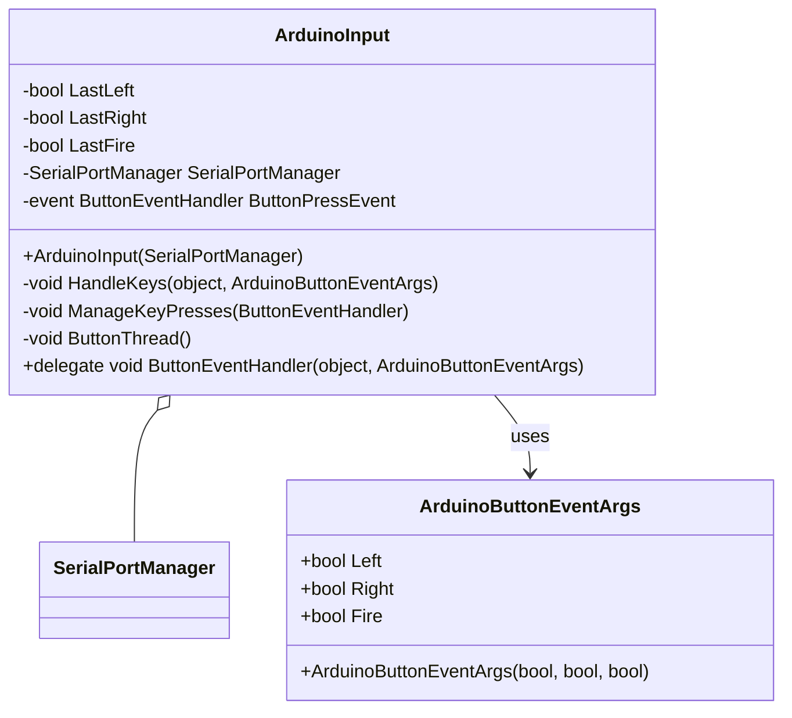
```mermaid
classDiagram
    class ArduinoButtonEventArgs {
        +bool Left
        +bool Right
        +bool Fire
        +ArduinoButtonEventArgs(bool, bool, bool)
    }

    class ArduinoInput {
        -bool LastLeft
        -bool LastRight
        -bool LastFire
        -SerialPortManager SerialPortManager
        -event ButtonEventHandler ButtonPressEvent
        +ArduinoInput(SerialPortManager)
        -void HandleKeys(object, ArduinoButtonEventArgs)
        -void ManageKeyPresses(ButtonEventHandler)
        -void ButtonThread()
        +delegate void ButtonEventHandler(object, ArduinoButtonEventArgs)
    }

    class SerialPortManager

    ArduinoInput o-- SerialPortManager
    ArduinoInput --> ArduinoButtonEventArgs : uses
```

---

### ConsoleDisplay

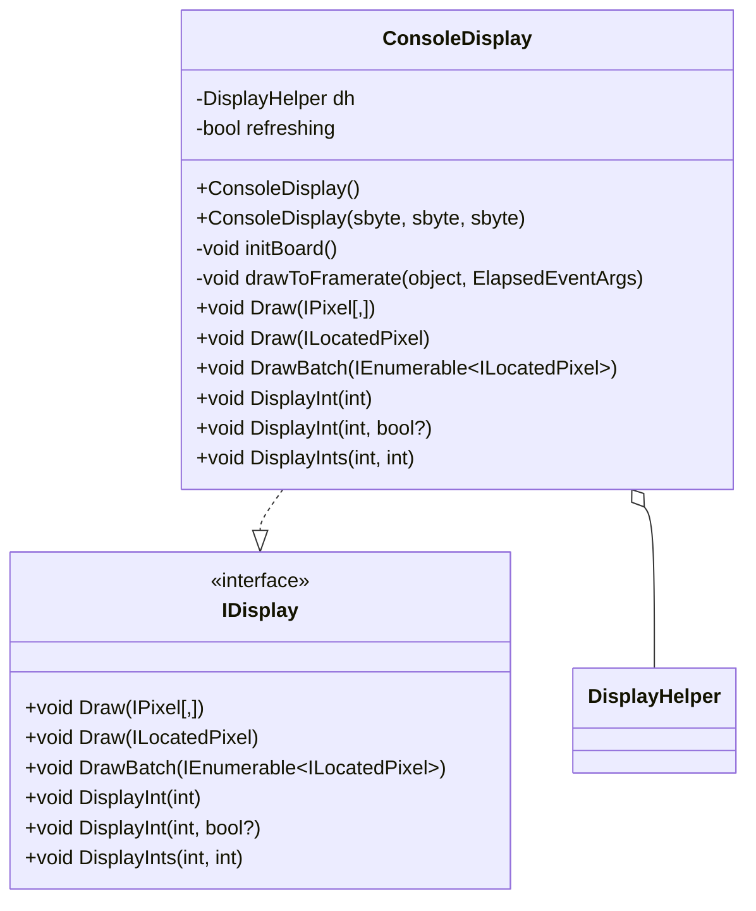
```mermaid
classDiagram
    class IDisplay {
        <<interface>>
        +void Draw(IPixel[,])
        +void Draw(ILocatedPixel)
        +void DrawBatch(IEnumerable~ILocatedPixel~)
        +void DisplayInt(int)
        +void DisplayInt(int, bool?)
        +void DisplayInts(int, int)
    }

    class ConsoleDisplay {
        -DisplayHelper dh
        -bool refreshing
        +ConsoleDisplay()
        +ConsoleDisplay(sbyte, sbyte, sbyte)
        -void initBoard()
        -void drawToFramerate(object, ElapsedEventArgs)
        +void Draw(IPixel[,])
        +void Draw(ILocatedPixel)
        +void DrawBatch(IEnumerable~ILocatedPixel~)
        +void DisplayInt(int)
        +void DisplayInt(int, bool?)
        +void DisplayInts(int, int)
    }

    class DisplayHelper

    ConsoleDisplay ..|> IDisplay
    ConsoleDisplay o-- DisplayHelper
```

---

### DisplayHelper

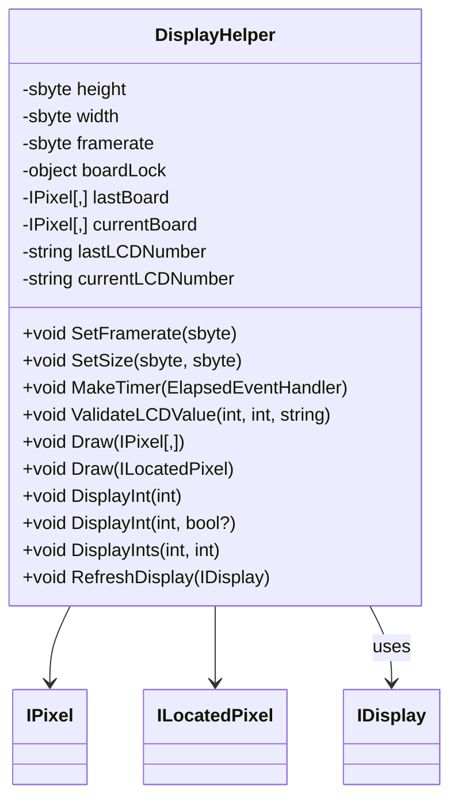
```mermaid
classDiagram
    class DisplayHelper {
        -sbyte height
        -sbyte width
        -sbyte framerate
        -object boardLock
        -IPixel[,] lastBoard
        -IPixel[,] currentBoard
        -string lastLCDNumber
        -string currentLCDNumber
        +void SetFramerate(sbyte)
        +void SetSize(sbyte, sbyte)
        +void MakeTimer(ElapsedEventHandler)
        +void ValidateLCDValue(int, int, string)
        +void Draw(IPixel[,])
        +void Draw(ILocatedPixel)
        +void DisplayInt(int)
        +void DisplayInt(int, bool?)
        +void DisplayInts(int, int)
        +void RefreshDisplay(IDisplay)
    }

    class IPixel
    class ILocatedPixel
    class IDisplay

    DisplayHelper --> IPixel
    DisplayHelper --> ILocatedPixel
    DisplayHelper --> IDisplay : uses
```

---

### IArduinoInput

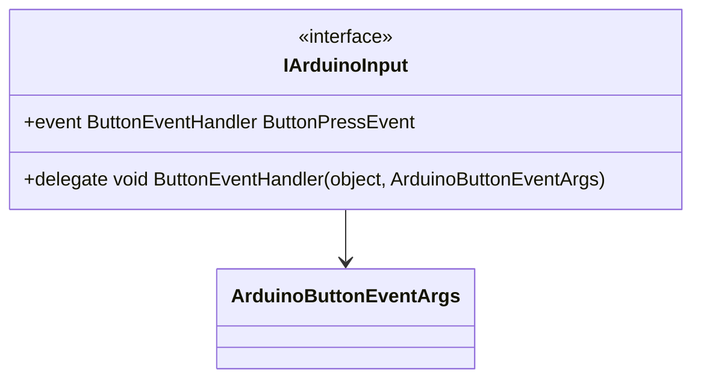
```mermaid
classDiagram
    class IArduinoInput {
        <<interface>>
        +event ButtonEventHandler ButtonPressEvent
        +delegate void ButtonEventHandler(object, ArduinoButtonEventArgs)
    }

    class ArduinoButtonEventArgs

    IArduinoInput --> ArduinoButtonEventArgs
```

---

### IDisplay

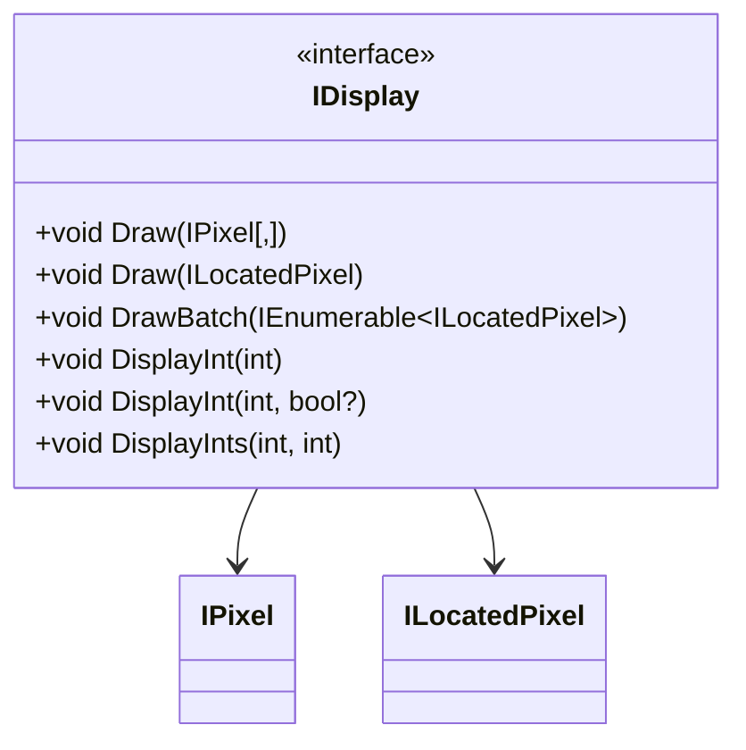
```mermaid
classDiagram
    class IDisplay {
        <<interface>>
        +void Draw(IPixel[,])
        +void Draw(ILocatedPixel)
        +void DrawBatch(IEnumerable~ILocatedPixel~)
        +void DisplayInt(int)
        +void DisplayInt(int, bool?)
        +void DisplayInts(int, int)
    }

    class IPixel
    class ILocatedPixel

    IDisplay --> IPixel
    IDisplay --> ILocatedPixel
```

---

### ILocatedPixel

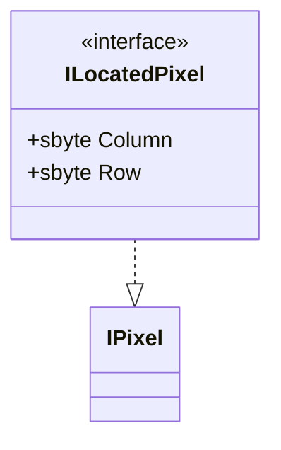
```mermaid
classDiagram
    class ILocatedPixel {
        <<interface>>
        +sbyte Column
        +sbyte Row
    }

    class IPixel

    ILocatedPixel ..|> IPixel
```

---

### IPixel

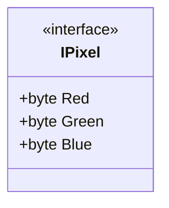
```mermaid
classDiagram
    class IPixel {
        <<interface>>
        +byte Red
        +byte Green
        +byte Blue
    }
```

---

### LocatedPixel

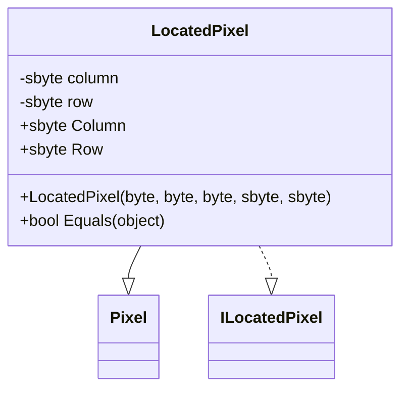
```mermaid
classDiagram
    class LocatedPixel {
        -sbyte column
        -sbyte row
        +sbyte Column
        +sbyte Row
        +LocatedPixel(byte, byte, byte, sbyte, sbyte)
        +bool Equals(object)
    }

    class Pixel
    class ILocatedPixel

    LocatedPixel --|> Pixel
    LocatedPixel ..|> ILocatedPixel
```

---

### Pixel

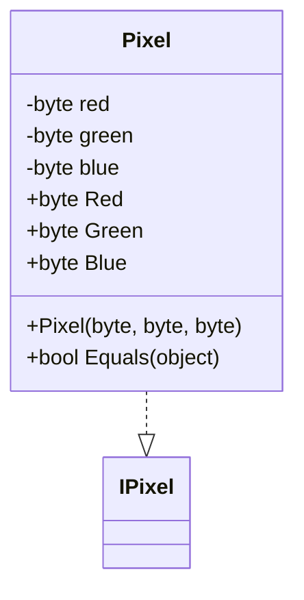
```mermaid
classDiagram
    class Pixel {
        -byte red
        -byte green
        -byte blue
        +byte Red
        +byte Green
        +byte Blue
        +Pixel(byte, byte, byte)
        +bool Equals(object)
    }

    class IPixel

    Pixel ..|> IPixel
```

---

### SerialPortManager

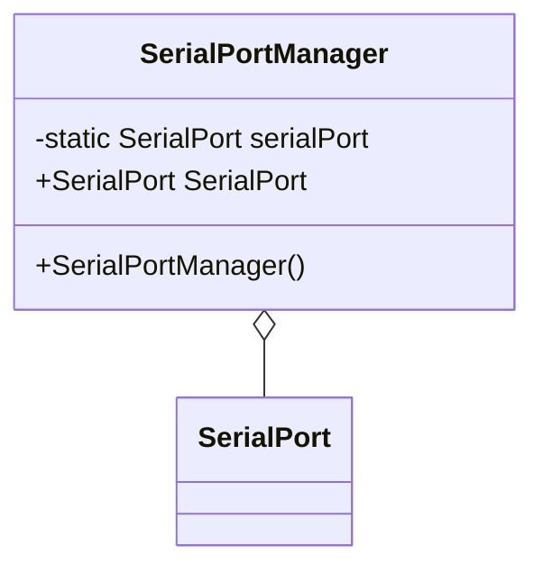
```mermaid
classDiagram
    class SerialPortManager {
        -static SerialPort serialPort
        +SerialPort SerialPort
        +SerialPortManager()
    }

    class SerialPort

    SerialPortManager o-- SerialPort
```
