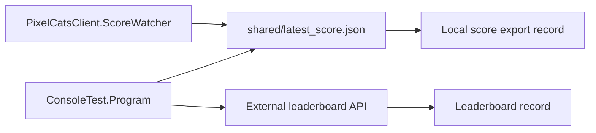

# Database Design

## Storage Model

The project uses two storage approaches:

1. A local JSON file, `shared/latest_score.json`, for score handoff inside the repository workspace.
2. An external leaderboard service accessed through HTTP endpoints.

## Local File-Based Storage

The local score file is written by `ConsoleTest/Program.cs` and read by `PixelCatsClient/ProgramHelpers.cs` and `ScoreWatcher.cs`.

### Observed Fields

| Field | Type | Required | Notes |
| --- | --- | --- | --- |
| `score` | integer | yes | Current score at the time of export. |
| `state` | string | no | Application state such as `Startup` or `GameOver`. |
| `gameName` | string | yes | Derived from the current game object. |
| `timestamp` | string | yes | ISO 8601 timestamp written by the exporter. |
| `code` | string | no | Added when the leaderboard claim code is available. |

### Persistence Behavior

- `ConsoleTest/Program.cs` writes the file atomically through a temporary file and then copies it into place.
- Consumers read the file in a retry loop to handle transient file access conflicts.
- `ScoreWatcher` uses the timestamp and state fields to detect new game-over events.

## External Leaderboard Data

The repository implies an external leaderboard record model from the API client code.

### Inferred Fields

| Field | Type | Notes |
| --- | --- | --- |
| `id` | integer | Used in leaderboard responses. |
| `name` | string | Player or score-owner name. |
| `score` | integer | The stored score value. |
| `created_at` | string | ISO-like timestamp string. |
| `gameName` / `game` / `gameId` | string | Game identifier or label, depending on endpoint. |

## Relationships

