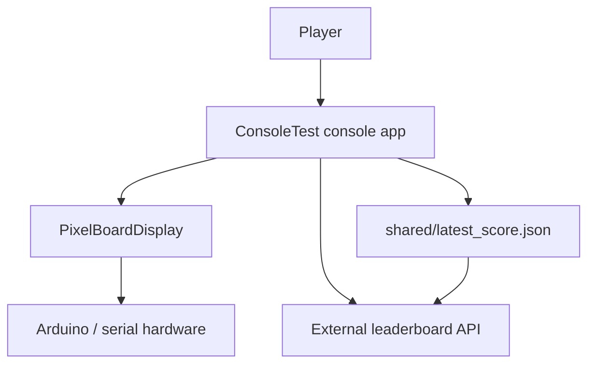
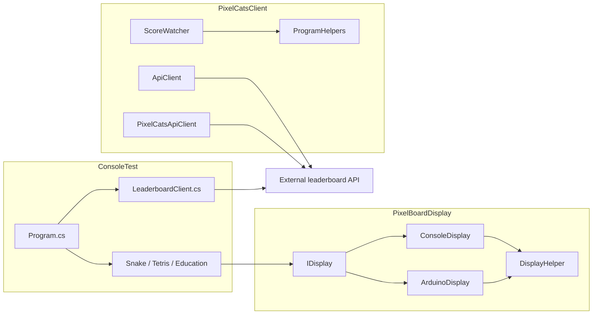
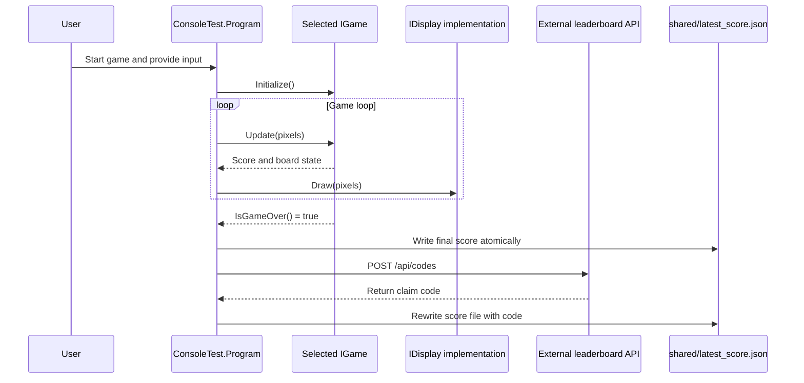
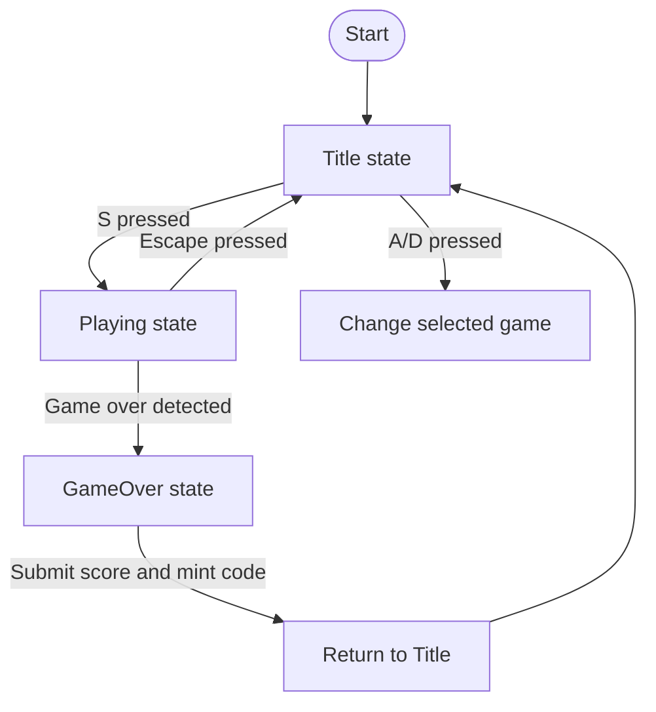
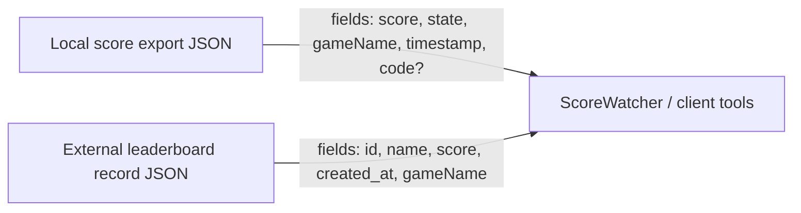
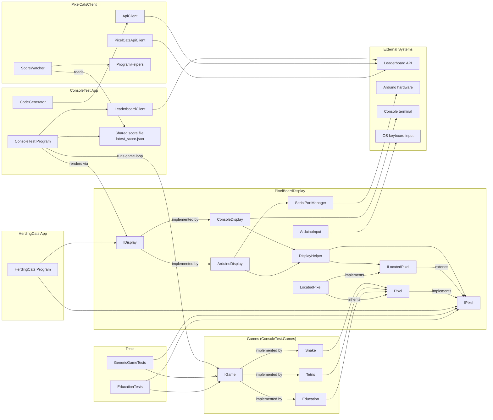

# Modelling and Diagrams

## System Context Diagram

## Container and Component Diagram

## Sequence Diagram for a Major User Workflow

## Activity Diagram

## Storage Model Diagram

The repository does not contain a physical relational database, so a traditional ERD is not applicable. The closest useful model is the file-backed score export plus the external leaderboard record.

## Detaile UML Diagram

