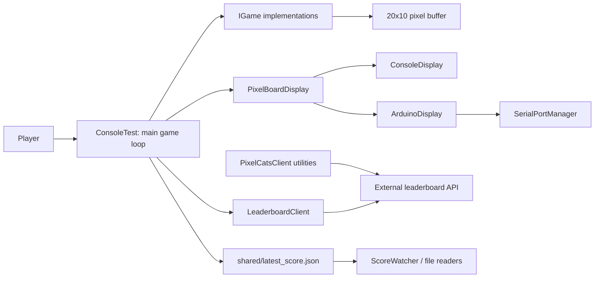
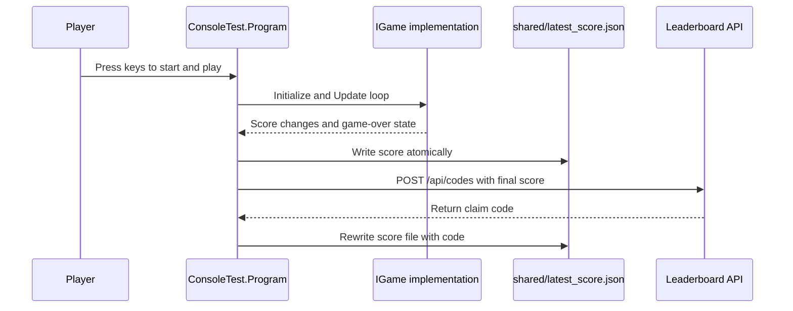

# System Architecture

## High-Level Architecture

The repository is organized as a set of cooperating client-side projects rather than a client-server application with an internal backend.

## Frontend and Backend Responsibilities

There backend framework is handled externally.

- `ConsoleTest/` acts as the interactive front-end and application coordinator.
- `PixelBoardDisplay/` acts as the presentation and hardware-adapter layer.
- `PixelCatsClient/` acts as an API client library and score-watching helper set.
- The external leaderboard API is the only backend-like service referenced by the code, but its implementation is not part of the repo.

## Module Interactions

- `ConsoleTest/Program.cs` loads configuration, instantiates the selected game, drives the state machine, and sends score data to the leaderboard service.
- `ConsoleTest/Games/IGame.cs` defines the game contract used by `Snake`, `Tetris`, and `Education`.
- Each game writes into the shared `IPixel[,]` buffer from `PixelBoardDisplay/`.
- `PixelBoardDisplay/ConsoleDisplay.cs` and `PixelBoardDisplay/ArduinoDisplay.cs` render the same logical board through different output channels.
- `PixelCatsClient/ProgramHelpers.cs` and `ScoreWatcher.cs` consume `shared/latest_score.json` as a local integration point.
- `PixelCatsClient/ApiClient.cs` and `ConsoleTest/Leaderboardclient.cs` call the external HTTP endpoints.

## Service Communication

The observed service communication paths are:

- HTTP POST to `/api/codes` for code submission and claim-code minting.
- HTTP GET to `/api/leaderboard?limit={n}` for leaderboard reads.
- HTTP GET to `/api/generate_code` for server-generated code retrieval.
- File I/O to `shared/latest_score.json` for score handoff.
- Serial communication through `SerialPortManager` for Arduino hardware output.

## Data Flow

1. The player starts a game from the console application.
2. The selected `IGame` implementation updates the shared pixel buffer and score state.
3. `ConsoleTest/Program.cs` reads the score and writes `shared/latest_score.json` atomically.
4. On game over, the console app submits the final score to the external API and receives a claim code.
5. The emulator display shows the current score or claim code, while the hardware path can stream the same state to an Arduino-connected board.

## Deployment Assumptions

- Windows desktop execution is assumed for the hardware and console display paths.
- .NET 9 is used for the main console solution, while the `Client/` project targets .NET 8.
- The Arduino output path assumes a serial device reachable at `COM5` unless changed in source.
- The leaderboard service is assumed to be reachable at the configured base URL, with defaults defined in `ConsoleTest/appsettings.json` and environment variables.

## Scalability Considerations

- The architecture is stateless at the application level except for the local score file and the in-memory game state.
- HTTP clients can be scaled independently because the repository does not host the server implementation.
- File-based score exchange is simple and portable, but it is not a high-concurrency persistence model.
- The display abstraction makes it possible to add more render targets without changing game logic, which keeps the architecture extensible.
